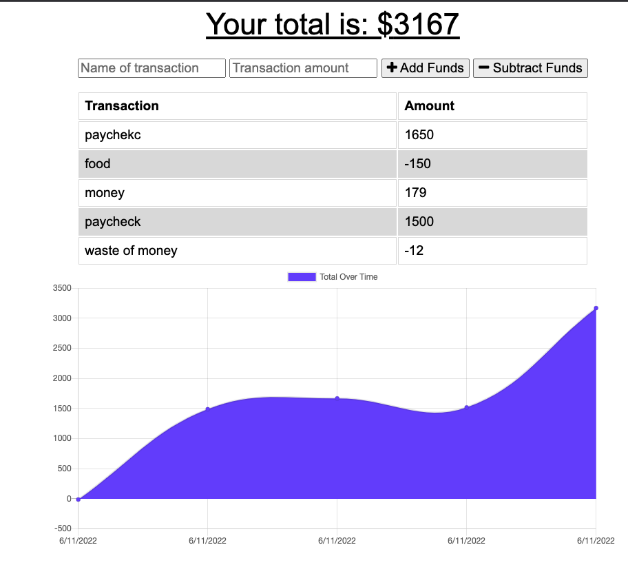

# Budget Tracker - 

**A deployed, single page application that allows the user to post their finances and track it with a graph!**

_Languages Used: Javascript, HTML, CSS, Express.js, Node.js, MongoDB and Mongoose_

## Table of Contents:

1. [Installation Instructions](#installation-instructions)
2. [Usage instructions](#usage-instructions)
3. [Contributor Guidelines](#contributor-guidelines)
4. [Testing instructions](#testing-instructions)
5. [Questions / Contact Information](#questions)
6. [Walkthrough Video / Screenshots](#screenshot)

### Installation Instructions:

- Application is deployed on [Heroku](https://superfishal-budget-tracker.herokuapp.com/)

### Usage Instructions:

- Use the input fields to start tracking your finances!

### Contributor Guidelines:

- Push to github for review!

### Testing Instructions:

- N/A

### Questions?

<aofish815@gmail.com>

Check out my **[Github](https://github.com/superfishal/budget-tracker)**

### Screenshot

